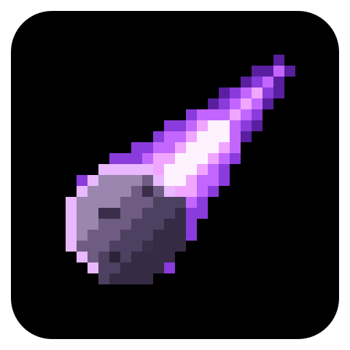
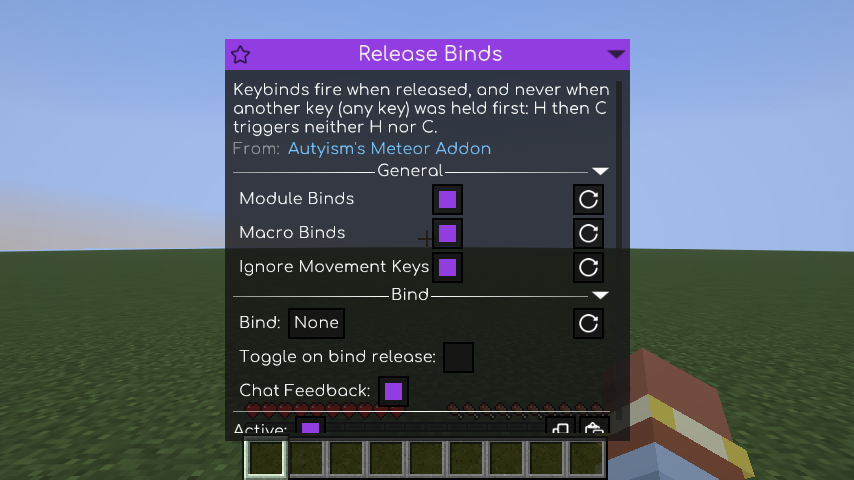

<h1 align="center">Autyism's Meteor Addon</h1>

Meteor Client keybinds that fire when you let go, and stay quiet during other mods' key combinations.

Meteor Client 的快捷键改为松开时触发，其他模组的组合键不再误触 Meteor 模块。

<a href="#english">English</a> · <a href="#简体中文">简体中文</a>

   

# English

An addon for [Meteor Client](https://meteorclient.com) that changes when Meteor's module and macro keybinds fire. It adds one module, **Release Binds**: a bind fires when you *release* its key, and not at all if another key was already held when you pressed it. Key combinations meant for other mods stop toggling your Meteor modules by accident.

**The problem.** Meteor reacts the moment a bind's key goes down, and a bind on a single key also fires while you are holding other keys. Say a Meteor module is bound to `C`, and another mod uses `Ctrl + C`, or "hold `H`, then press `C`", for one of its own actions. Every time you use that combination, the Meteor module toggles as well. If `H` is also a Meteor bind, that module toggles as soon as you press `H`, before you have even reached `C`.

**With Release Binds on:**

- Tap `C` on its own: the module toggles when you let go.
- Hold `H`, press `C`, let go in any order: nothing toggles. `C` was pressed while `H` was held, and `H` was used as the first key of a combination.
- Hold `Ctrl`, press `C`: the plain `C` bind stays quiet. A Meteor bind set to `Ctrl + C` fires instead.

The other mod still receives every key as usual. Release Binds never blocks a key; it only decides when Meteor reacts.

## Features

### When binds fire

- **Fire on release.** Module binds and macros trigger when you let go of the key, not when you press it. This is what makes everything else possible: at the moment a key goes down, there is no way to know yet whether you are about to press a second key with it.
- **Hold-to-activate modules keep working.** Modules with Meteor's *Toggle on bind release* option still turn on when you press the key and off when you let go. They follow the prefix rule too: if another key was already held, the module does not turn on.
- **Menus and chat are left alone.** A key pressed while a menu, the chat or Meteor's own GUI is open never triggers a bind, even if you let go after the menu has closed. Closing your inventory with a key does not also toggle a module bound to that key.

### Key combinations

- **Any key can be a prefix.** If another key was held when you pressed a bind's key, the bind does not fire. This is not limited to Ctrl, Shift and Alt: letters, numbers, function keys and mouse buttons count as well.
- **The first key of a combination stays quiet too.** If you press another key while still holding a bind's key, that bind does not fire when you let go. With `H` then `C`, neither the `H` bind nor the `C` bind fires.
- **Exact modifiers.** A bind with modifiers, such as `Ctrl + X`, fires only when exactly those modifier keys are held and no other key. A plain `C` bind and a `Ctrl + C` bind can now sit side by side without both firing.
- **Walking and mining don't get in the way.** The keys bound to moving, jumping, sneaking, sprinting, attacking and using items don't count as prefix keys, so binds still fire while you walk or hold the mouse button to mine. This follows your current Minecraft controls and can be turned off. Ctrl, Shift, Alt and Super are the exception: they always count, even when one of them is your sneak or sprint key.

### What it covers

- **Every Meteor module**, including modules added by other Meteor addons.
- **Macros.** Meteor macros follow the same rules and run once when you let go of the key.
- **Mouse buttons.** Binds on mouse buttons (for example the side buttons) fire on release as well, and a held mouse button can act as a prefix.
- **Nothing else.** Meteor's Open GUI and Open Commands keys, assigning binds, key options inside a module's own settings, vanilla controls and other mods' keys all work exactly as before.

### Safe defaults

- **On from the first start.** Release Binds switches itself on the first time you start the game with the addon. After that, Meteor remembers whether you left it on or off.
- **Easy to undo.** Turning Release Binds off brings back Meteor's normal behaviour completely. You can also limit it to module binds or to macro binds only.
- **No stuck keys.** If the game misses a key release (for example when you Alt-Tab away while holding a key), that key does not stay "held" and block your binds.

## Screenshots

*The Release Binds module and its settings in Meteor's GUI.*

## How to use

The addon adds no keys or commands of its own. Release Binds is a normal Meteor module, so you manage it like any other module.

### Keys

| Action | Default key | Where to change it |
|---|---|---|
| Open Meteor's ClickGUI (Release Binds is in the **Misc** window) | Right Shift | Minecraft Options → Controls → Key Binds → *Meteor Client* → **Open GUI** |
| Toggle a Meteor module | None (set your own) | Right-click the module in the ClickGUI → **Bind** |
| Run a Meteor macro | None (set your own) | ClickGUI → **Macros** tab → the macro's **Keybind** |

If you use Mod Menu, Meteor Client's config button opens the same ClickGUI.

### Commands

Meteor's own commands work with Release Binds (Meteor's default command prefix is `.`):

| Command | What it does |
|---|---|
| `.toggle release-binds` | Turns Release Binds on or off |
| `.settings release-binds` | Opens its settings |
| `.settings release-binds <setting> <value>` | Changes a setting, for example `.settings release-binds ignore-movement-keys false` |

### Getting started

1. Install the addon next to Meteor Client and Fabric API, and start the game.
2. Release Binds is already on. Your existing Meteor binds now fire when you release the key.
3. To look at its settings, press Right Shift, find **Release Binds** in the **Misc** window and right-click it. A left-click turns it on or off.

### Using another mod's key combination

1. Hold the first key of the combination, then press the second key.
2. Let go in any order. Neither key fires a Meteor bind, and the other mod still gets both keys.

### A module that is only on while you hold its key

1. Right-click the module in the ClickGUI.
2. Under **Bind**, tick **Toggle on bind release**.
3. Hold the key to keep the module on and let go to turn it off. If another key is already held when you press the key, the module stays off.

### What Release Binds changes

| Meteor feature | With Release Binds on |
|---|---|
| Module binds | Fire when released, following the prefix rules (setting **Module Binds**) |
| Modules with *Toggle on bind release* | On when pressed (only without a prefix key), off when released |
| Macro binds | Run once when released, following the prefix rules (setting **Macro Binds**) |
| Mouse button binds | Same rules as keyboard keys |
| Open GUI and Open Commands keys | Unchanged |
| Assigning a bind | Unchanged |
| Key options inside a module's own settings | Unchanged |
| Vanilla controls and other mods' keys | Unchanged; no key is ever blocked |

## Settings

Open them with Right Shift → **Misc** → right-click **Release Binds**, or with `.settings release-binds`.

| Setting | Command name | Default | What it does |
|---|---|---|---|
| Release Binds (the module itself) | `release-binds` | On (switched on at first start) | Turns the addon's behaviour on or off. When it is off, Meteor handles keys the normal way. |
| Module Binds | `module-binds` | On | Applies the release and prefix rules to module keybinds. |
| Macro Binds | `macro-binds` | On | Applies the release and prefix rules to macro keybinds. |
| Ignore Movement Keys | `ignore-movement-keys` | On | The keys bound to moving, jumping, sneaking, sprinting, attacking and using never count as prefix keys, so binds still fire while you walk or mine. Ctrl, Shift, Alt and Super (the Windows or Command key) always count, even when one of them is your sneak or sprint key. Turn this off to make every held key count. |

## Requirements

- Minecraft Java Edition 1.21.11
- Fabric Loader 0.17.0 or newer (Meteor Client 1.21.11 build 86 itself needs 0.18.2 or newer)
- [Fabric API](https://modrinth.com/mod/fabric-api)
- **Meteor Client for Minecraft 1.21.11 (required).** Meteor Client is not on Modrinth; download it from [meteorclient.com](https://meteorclient.com). This addon is built against Meteor Client build 86 (version `1.21.11-86`).
- Java 21 or newer

**Side:** client only. Servers do not need it, and it sends nothing to the server. It works in singleplayer and multiplayer.

## Compatibility

- **Other Meteor addons:** their modules follow the same rules as Meteor's own modules.
- **Other mods' keybinds:** never blocked or changed. The addon only decides when Meteor reacts to a key; vanilla and other mods still see every key press.
- **Rendering mods such as Sodium or Iris:** not affected. The addon only reads keyboard and mouse button input.
- **Meteor versions:** built against Meteor Client 1.21.11 build 86. The addon changes how Meteor handles module and macro binds, so a later Meteor build that reworks that part may need an updated version of this addon. If the game no longer starts after a Meteor update, remove the addon and please open an [issue](https://github.com/Autyism/autyism-meteor/issues).

## Installation

1. Install [Fabric Loader](https://fabricmc.net/use/) for Minecraft 1.21.11.
2. Download [Fabric API](https://modrinth.com/mod/fabric-api) and [Meteor Client](https://meteorclient.com) for 1.21.11.
3. Download `autyism-meteor-addon-1.0.0.jar` from Modrinth or the GitHub releases.
4. Put all three jar files into the `mods` folder of your game directory (or of your launcher's instance).
5. Start the game. Release Binds is already on; you find it in Meteor's ClickGUI (Right Shift) under **Misc**.

## FAQ

**My module now toggles only when I let go of the key. Is that right?**

Yes. Only once you let go can the addon tell a single tap from the start of a key combination.

**A bind does nothing while I sneak or sprint.**

Ctrl, Shift, Alt and Super always count as prefix keys, even when they are your sneak or sprint keys (Minecraft's defaults are Left Shift for sneak and Left Ctrl for sprint). Let go of them before tapping the bind, or set Sneak or Sprint to "Toggle" in Minecraft's controls so you don't have to hold the key.

**I used a key combination and my Meteor module did not toggle.**

That is what the addon is for: if another key was held when you pressed the bind's key, or you pressed another key while holding it, the bind does not fire.

**Is this the same as Meteor's "Toggle on bind release" option?**

No. That option makes a single module active only while you hold its key. Release Binds changes when all binds fire and adds the prefix rule. Modules that use the option keep working as described above.

**Does it change the key that opens Meteor's GUI?**

No. The Open GUI and Open Commands keys work exactly as before.

**Does it work with modules from other Meteor addons?**

Yes. It applies to every Meteor module, whichever addon added it.

**How do I get Meteor's normal behaviour back?**

Turn Release Binds off (left-click it in the Misc window, or `.toggle release-binds`). To keep it for only one kind of bind, turn off **Module Binds** or **Macro Binds** instead.

**Release Binds was already on. Did I do that?**

It switches itself on the first time you start the game with the addon. After that, your choice is kept like for any other module.

**Does the server need it?**

No. It is client-only and sends nothing to the server.

## Known limitations

- Binds react when you release the key, so they fire a moment later than with Meteor's default behaviour. Modules with *Toggle on bind release* still turn on as soon as you press the key.
- Ctrl, Shift, Alt and Super always count as prefix keys. With Minecraft's default controls (sneak on Left Shift, sprint on Left Ctrl), a bind only fires while you hold the sneak or sprint key if it includes that key as a modifier (such as `Shift + C`).
- Any other held key blocks a bind, apart from the keys bound to moving, jumping, sneaking, sprinting, attacking and using. For example, holding the player list key or another mod's hold-to-use key (such as a zoom key) keeps binds from firing while it is held.
- Holding a macro key does not repeat the macro. It runs once each time you release the key.
- Built against Meteor Client 1.21.11 build 86. Later Meteor builds may need an update of this addon.

## Credits

- [Meteor Client](https://github.com/MeteorDevelopment/meteor-client) by MineGame159, squidoodly, seasnail and contributors: the client this addon extends.
- [Fabric](https://fabricmc.net) (Fabric Loader and Fabric API).

## License

GPL-3.0-or-later: this addon is free software under the GNU General Public License, version 3 or (at your option) any later version.

# 简体中文

这是一个 [Meteor Client](https://meteorclient.com) 插件（addon），用来改变 Meteor 模块和宏的快捷键触发方式。它只添加一个模块 **Release Binds**：快捷键在**松开**时才触发；如果按下它时已经按住了别的键，就完全不触发。这样，给其他模组用的组合键就不会再顺手把 Meteor 模块开开关关。

**问题在哪。** Meteor 在快捷键按下的一瞬间就触发，而且只绑了一个键的快捷键，在你按住别的键时也照样触发。假设你把某个 Meteor 模块绑在 `C` 上，而另一个模组的某个功能用的是 `Ctrl + C`，或者“按住 `H` 再按 `C`”。每次你用这个组合键，Meteor 模块都会跟着切换。如果 `H` 也绑了 Meteor 模块，那个模块在你按下 `H` 的一瞬间就切换了，你还没来得及按 `C`。

**开启 Release Binds 后：**

- 单独点一下 `C`：松开时模块切换。
- 按住 `H`，再按 `C`，然后以任意顺序松开：什么都不切换。`C` 是在按住 `H` 时按下的，而 `H` 当了组合键的前置键。
- 按住 `Ctrl` 再按 `C`：只绑了 `C` 的快捷键不触发；如果你在 Meteor 里绑了 `Ctrl + C`，触发的是它。

另一个模组照常收到所有按键。Release Binds 从不拦截按键，只决定 Meteor 什么时候响应。

## 功能

### 什么时候触发

- **松开触发。** 模块快捷键和宏在松开按键时触发，而不是按下时。这是其他一切的前提：按键按下的那一刻，还无法知道你接下来会不会再按一个键组成组合键。
- **“按住生效”的模块照常可用。** 开了 Meteor「Toggle on bind release」选项的模块，依旧是按下开启、松开关闭。它们同样遵守前置键规则：按下前已经按住了别的键，模块就不会开启。
- **不干扰界面和聊天。** 在菜单、聊天栏或 Meteor 自己的界面打开时按下的键，永远不会触发快捷键，即使你在界面关掉之后才松开。用某个键关掉背包时，不会顺带切换绑在这个键上的模块。

### 组合键

- **任何键都能当前置键。** 按下快捷键时，只要已经按住了别的键，这个快捷键就不触发。不只是 Ctrl、Shift、Alt：字母、数字、F 键和鼠标按键都算。
- **组合键的第一个键也不会触发。** 按住某个快捷键期间又按了别的键，松开时这个快捷键不会触发。先按 `H` 再按 `C`，`H` 和 `C` 的快捷键都不触发。
- **修饰键精确匹配。** 带修饰键的快捷键（如 `Ctrl + X`）只有在按住的修饰键正好是这几个、并且没有按住其他键时才触发。只绑 `C` 的快捷键和 `Ctrl + C` 的快捷键现在可以并存，不会一起触发。
- **走路、挖掘不受影响。** 绑在移动、跳跃、潜行、疾跑、攻击、使用上的键不算前置键，所以边走路、边按住鼠标挖方块也能正常用快捷键。它会跟着你当前的原版键位设置走，也可以关掉。例外是 Ctrl、Shift、Alt 和 Super：它们永远算前置键，哪怕是你的潜行或疾跑键。

### 适用范围

- **所有 Meteor 模块**，包括其他 Meteor 插件添加的模块。
- **宏。** Meteor 的宏遵守同样的规则，松开按键时运行一次。
- **鼠标按键。** 绑在鼠标按键（比如侧键）上的快捷键同样松开触发；按住的鼠标按键也能当前置键。
- **其他都不变。** Meteor 的「打开GUI」「输入命令」键（Open GUI / Open Commands）、设置快捷键的过程、模块设置里自带的按键选项、原版键位以及其他模组的按键，都和原来完全一样。

### 稳妥的默认值

- **首次启动即开启。** 第一次带着这个插件启动游戏时，Release Binds 会自动开启。之后 Meteor 会记住你是开着还是关着。
- **随时还原。** 关掉 Release Binds 就完全恢复 Meteor 原本的行为。也可以只对模块快捷键或只对宏生效。
- **不会“卡键”。** 如果游戏漏掉了某次松开（比如按着键时 Alt-Tab 切出去），这个键不会一直被当成“按住”而挡住你的快捷键。

## 截图

*Meteor 界面里的 Release Binds 模块和它的设置。*

## 使用方法

这个插件本身不添加任何按键或命令。Release Binds 是一个普通的 Meteor 模块，和其他模块一样管理。

### 按键

| 操作 | 默认按键 | 在哪里修改 |
|---|---|---|
| 打开 Meteor 的 ClickGUI（Release Binds 在 **Misc** 窗口里） | 右 Shift | 选项 → 控制 → 按键绑定 → *Meteor Client* → **打开GUI** |
| 切换 Meteor 模块 | 无（自己设置） | 在 ClickGUI 里右键模块 → **Bind** |
| 运行 Meteor 宏 | 无（自己设置） | ClickGUI → **Macros** 标签页 → 宏的 **Keybind** |

如果装了 Mod Menu，点击 Meteor Client 的配置按钮也会打开同一个 ClickGUI。

### 命令

Meteor 自带的命令可以直接用于 Release Binds（Meteor 默认命令前缀是 `.`）：

| 命令 | 作用 |
|---|---|
| `.toggle release-binds` | 开启或关闭 Release Binds |
| `.settings release-binds` | 打开它的设置 |
| `.settings release-binds <设置名> <值>` | 修改设置，例如 `.settings release-binds ignore-movement-keys false` |

### 快速上手

1. 把插件和 Meteor Client、Fabric API 一起装好，启动游戏。
2. Release Binds 已经开启。你原有的 Meteor 快捷键现在会在松开时触发。
3. 想看设置：按右 Shift，在 **Misc** 窗口里找到 **Release Binds**，右键打开设置。左键是开关。

### 使用其他模组的组合键

1. 先按住组合键的第一个键，再按第二个键。
2. 以任意顺序松开。两个键都不会触发 Meteor 快捷键，另一个模组照常收到这两个键。

### 只在按住时生效的模块

1. 在 ClickGUI 里右键这个模块。
2. 在 **Bind** 一栏勾选 **Toggle on bind release**。
3. 按住按键时模块开启，松开就关闭。如果按下时已经按住了别的键，模块不会开启。

### Release Binds 改变了什么

| Meteor 功能 | 开启 Release Binds 后 |
|---|---|
| 模块快捷键 | 松开时触发，遵守前置键规则（设置 **Module Binds**） |
| 开了 *Toggle on bind release* 的模块 | 按下开启（仅在没有前置键时），松开关闭 |
| 宏快捷键 | 松开时运行一次，遵守前置键规则（设置 **Macro Binds**） |
| 鼠标按键快捷键 | 规则和键盘按键相同 |
| 「打开GUI」「输入命令」键 | 不变 |
| 设置快捷键 | 不变 |
| 模块设置里自带的按键选项 | 不变 |
| 原版键位和其他模组的按键 | 不变，任何按键都不会被拦截 |

## 设置

打开方式：右 Shift → **Misc** → 右键 **Release Binds**，或输入 `.settings release-binds`。Meteor 的界面只有英文，下表使用游戏里显示的名字。

| 设置 | 命令中的名字 | 默认值 | 作用 |
|---|---|---|---|
| Release Binds（模块本身） | `release-binds` | 开（首次启动时自动开启） | 总开关。关闭时 Meteor 按原本的方式处理按键。 |
| Module Binds | `module-binds` | 开 | 对模块快捷键使用松开触发和前置键规则。 |
| Macro Binds | `macro-binds` | 开 | 对宏快捷键使用松开触发和前置键规则。 |
| Ignore Movement Keys | `ignore-movement-keys` | 开 | 绑在移动、跳跃、潜行、疾跑、攻击、使用上的键不算前置键，边走路、边挖掘也能用快捷键。Ctrl、Shift、Alt 和 Super（Windows 键 / Command 键）永远算前置键，哪怕是你的潜行或疾跑键。关闭后，按住任何键都算前置键。 |

## 前置要求

- Minecraft Java 版 1.21.11
- Fabric Loader 0.17.0 或更新（Meteor Client 1.21.11 build 86 本身需要 0.18.2 或更新）
- [Fabric API](https://modrinth.com/mod/fabric-api)
- **Meteor Client（Minecraft 1.21.11 版，必需）。** Meteor Client 不在 Modrinth 上，请到 [meteorclient.com](https://meteorclient.com) 下载。本插件基于 Meteor Client build 86（版本号 `1.21.11-86`）构建。
- Java 21 或更新

**运行端：** 仅客户端。服务器不需要安装，插件也不会向服务器发送任何内容。单人和多人游戏都能用。

## 兼容性

- **其他 Meteor 插件：** 它们添加的模块和 Meteor 自带模块遵守同样的规则。
- **其他模组的快捷键：** 不会被拦截或改变。插件只决定 Meteor 什么时候响应按键，原版和其他模组照常收到每一次按键。
- **Sodium、Iris 等渲染类模组：** 不受影响。插件只读取键盘和鼠标按键输入。
- **Meteor 版本：** 基于 Meteor Client 1.21.11 build 86 构建。插件修改了 Meteor 处理模块和宏快捷键的方式，如果以后的 Meteor 版本重写了这部分，可能需要更新本插件。如果更新 Meteor 后游戏无法启动，请先移除本插件，并欢迎提交 [issue](https://github.com/Autyism/autyism-meteor/issues)。

## 安装

1. 安装 Minecraft 1.21.11 的 [Fabric Loader](https://fabricmc.net/use/)。
2. 下载 1.21.11 版本的 [Fabric API](https://modrinth.com/mod/fabric-api) 和 [Meteor Client](https://meteorclient.com)。
3. 从 Modrinth 或 GitHub Releases 下载 `autyism-meteor-addon-1.0.0.jar`。
4. 把这三个 jar 文件放进游戏目录（或启动器版本隔离目录）的 `mods` 文件夹。
5. 启动游戏。Release Binds 已经开启，可以在 Meteor 的 ClickGUI（右 Shift）的 **Misc** 里找到它。

## 常见问题

**现在模块要松开按键才切换，这正常吗？**

正常。只有等你松开，插件才能分辨这是单独点一下，还是组合键的开头。

**潜行或疾跑时快捷键没反应。**

Ctrl、Shift、Alt 和 Super 永远算前置键，哪怕是你的潜行或疾跑键（原版默认潜行是左 Shift，疾跑是左 Ctrl）。先松开它们再按快捷键，或者在原版控制设置里把潜行 / 疾跑改成“切换”模式，就不用一直按住了。

**我按了组合键，Meteor 模块没切换。**

这正是插件的作用：按下快捷键时已经按住了别的键，或者按住快捷键期间又按了别的键，这个快捷键就不会触发。

**这和 Meteor 的「Toggle on bind release」是一回事吗？**

不是。那个选项让某一个模块只在按住按键时生效；Release Binds 改变的是所有快捷键的触发时机，并加上前置键规则。用那个选项的模块照常工作，见上文。

**会改变打开 Meteor 界面的按键吗？**

不会。「打开GUI」和「输入命令」键和原来完全一样。

**对其他 Meteor 插件的模块有效吗？**

有效。所有 Meteor 模块都适用，不管是哪个插件添加的。

**怎么恢复 Meteor 原本的行为？**

关掉 Release Binds（在 Misc 窗口里左键点击它，或输入 `.toggle release-binds`）。如果只想对其中一种快捷键生效，可以单独关掉 **Module Binds** 或 **Macro Binds**。

**Release Binds 一开始就是开着的，是我开的吗？**

第一次带着插件启动游戏时它会自动开启。之后和其他模块一样，保留你自己的选择。

**服务器需要装吗？**

不需要。它只在客户端运行，不会向服务器发送任何内容。

## 已知限制

- 快捷键在松开时才响应，所以会比 Meteor 默认的按下触发稍晚一点。开了 *Toggle on bind release* 的模块仍然是一按下就开启。
- Ctrl、Shift、Alt 和 Super 永远算前置键。在原版默认键位下（潜行是左 Shift，疾跑是左 Ctrl），按住潜行或疾跑键时，只有把这个键作为修饰键绑进去的快捷键（如 `Shift + C`）才会触发。
- 除了绑在移动、跳跃、潜行、疾跑、攻击、使用上的键，按住任何其他键都会挡住快捷键。例如按住玩家列表键，或其他模组需要按住的键（比如缩放键）时，快捷键不会触发。
- 按住宏的按键不会重复运行宏，每次松开只运行一次。
- 基于 Meteor Client 1.21.11 build 86 构建，以后的 Meteor 版本可能需要更新本插件。

## 致谢

- [Meteor Client](https://github.com/MeteorDevelopment/meteor-client)，作者 MineGame159、squidoodly、seasnail 及所有贡献者：本插件所扩展的客户端。
- [Fabric](https://fabricmc.net)（Fabric Loader 和 Fabric API）。

## 许可证

GPL-3.0-or-later：本插件是自由软件，按 GNU 通用公共许可证第 3 版或（由你选择）任何更新的版本发布。
